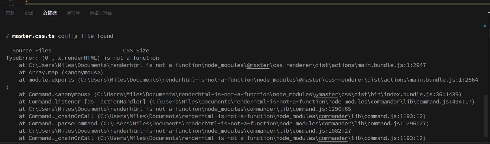

Minimal reproduction of the error ``TypeError: (0 , x.renderHTML) is not a function``

## Steps
- Clone this repo
```shell
$ git clone https://github.com/0Miles/renderhtml-is-not-a-function.git
$ cd renderhtml-is-not-a-function
```
  
- Install
```shell
$ npm i
```
  
- Run build
```shell
$ npm run build
```

- Error
